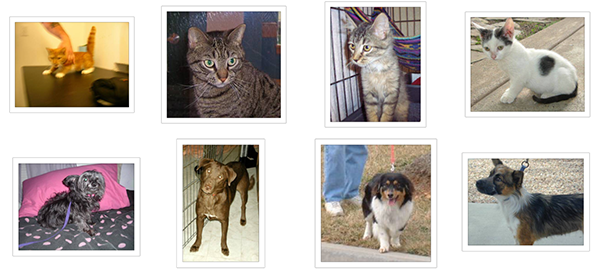

### Building powerful image classification models using very little data
In this tutorial, we will present a few simple yet effective methods that you can use to build a powerful image classifier, using only very few training examples --just a few hundred or thousand pictures from each class you want to be able to recognize.
We will go over the following options:

- training a small network from scratch (as a baseline)</li>
- using the bottleneck features of a pre-trained network</li>
- fine-tuning the top layers of a pre-trained network</li>

This will lead us to cover the following Keras features:

1. fit_generator for training Keras a model using Python data generators
2. <code>ImageDataGenerator</code> for real-time data augmentation
3. layer freezing and model fine-tuning

<strong>Note: all code examples have been updated to the Keras 2.0 API on March 14, 2017. You will need Keras version 2.0.0 or higher to run them.</strong>

<h2>Our setup: only 2000 training examples (1000 per class)</h2>

We will start from the following setup:

<ul>
<li>a machine with Keras, SciPy, PIL installed. If you have a NVIDIA GPU that you can use (and cuDNN installed), that's great, but since we are working with few images that isn't strictly necessary.</li>
<li>a training data directory and validation data directory containing one subdirectory per image class, filled with .png or .jpg images:</li>
</ul>

<pre>data/
    train/
        dogs/
            dog001.jpg
            dog002.jpg
            ...
        cats/
            cat001.jpg
            cat002.jpg
            ...
    validation/
        dogs/
            dog001.jpg
            dog002.jpg
            ...
        cats/
            cat001.jpg
            cat002.jpg
            ...
</pre>

To acquire a few hundreds or thousands of training images belonging to the classes you are interested in, one possibility would be to use the <a href="https://www.flickr.com/services/api/">Flickr API</a> to download pictures matching a given tag, under a friendly license.

In our examples we will use two sets of pictures, which we got <a href="https://www.kaggle.com/c/dogs-vs-cats/data">from Kaggle</a>: 1000 cats and 1000 dogs (although the original dataset had 12,500 cats and 12,500 dogs, we just took the first 1000 images for each class). We also use 400 additional samples from each class as validation data, to evaluate our models.

That is very few examples to learn from, for a classification problem that is far from simple. So this is a challenging machine learning problem, but it is also a realistic one: in a lot of real-world use cases, even small-scale data collection can be extremely expensive or sometimes near-impossible (e.g. in medical imaging). Being able to make the most out of very little data is a key skill of a competent data scientist.

How difficult is this problem? When Kaggle started the cats vs. dogs competition (with 25,000 training images in total), a bit over two years ago, it came with the following statement:

<em>"In an informal poll conducted many years ago, computer vision experts posited that a classifier with better than 60% accuracy would be difficult without a major advance in the state of the art. For reference, a 60% classifier improves the guessing probability of a 12-image HIP from 1/4096 to 1/459.
The current literature suggests machine classifiers can score above 80% accuracy on this task <a href="http://xenon.stanford.edu/~pgolle/papers/dogcat.pdf">[ref]</a>."</em>

In the resulting competition, top entrants were able to score over 98% accuracy by using modern deep learning techniques. In our case, because we restrict ourselves to only 8% of the dataset, the problem is much harder.

<h2>On the relevance of deep learning for small-data problems</h2>

A message that I hear often is that "deep learning is only relevant when you have a huge amount of data". While not entirely incorrect, this is somewhat misleading. Certainly, deep learning requires the ability to learn features automatically from the data, which is generally only possible when lots of training data is available --especially for problems where the input samples are very high-dimensional, like images. However, convolutional neural networks --a pillar algorithm of deep learning-- are by design one of the best models available for most "perceptual" problems (such as image classification), even with very little data to learn from. Training a convnet from scratch on a small image dataset will still yield reasonable results, without the need for any custom feature engineering. Convnets are just plain good. They are the right tool for the job.

But what's more, deep learning models are by nature highly repurposable: you can take, say, an image classification or speech-to-text model trained on a large-scale dataset then reuse it on a significantly different problem with only minor changes, as we will see in this post. Specifically in the case of computer vision, many pre-trained models (usually trained on the ImageNet dataset) are now publicly available for download and can be used to bootstrap powerful vision models out of very little data.

<h2>Data pre-processing and data augmentation</h2>

In order to make the most of our few training examples, we will "augment" them via a number of random transformations, so that our model would never see twice the exact same picture. This helps prevent overfitting and helps the model generalize better.

In Keras this can be done via the <code>keras.preprocessing.image.ImageDataGenerator</code> class. This class allows you to:

<ul>
<li>configure random transformations and normalization operations to be done on your image data during training</li>
<li>instantiate generators of augmented image batches (and their labels) via <code>.flow(data, labels)</code> or <code>.flow_from_directory(directory)</code>. These generators can then be used with the Keras model methods that accept data generators as inputs, <code>fit_generator</code>, <code>evaluate_generator</code> and <code>predict_generator</code>.</li>
</ul>

Let's look at an example right away:

<pre>from keras.preprocessing.image import ImageDataGenerator

datagen = ImageDataGenerator(
        rotation_range=40,
        width_shift_range=0.2,
        height_shift_range=0.2,
        rescale=1./255,
        shear_range=0.2,
        zoom_range=0.2,
        horizontal_flip=True,
        fill_mode='nearest')
</pre>

These are just a few of the options available (for more, see <a href="http://keras.io/preprocessing/image/">the documentation</a>). Let's quickly go over what we just wrote:

<ul>
<li><code>rotation_range</code> is a value in degrees (0-180), a range within which to randomly rotate pictures</li>
<li><code>width_shift</code> and <code>height_shift</code> are ranges (as a fraction of total width or height) within which to randomly translate pictures vertically or horizontally</li>
<li><code>rescale</code> is a value by which we will multiply the data before any other processing. Our original images consist in RGB coefficients in the 0-255, but such values would be too high for our models to process (given a typical learning rate), so we target values between 0 and 1 instead by scaling with a 1/255. factor.</li>
<li><code>shear_range</code> is for randomly applying <a href="https://en.wikipedia.org/wiki/Shear_mapping">shearing transformations</a></li>
<li><code>zoom_range</code> is for randomly zooming inside pictures</li>
<li><code>horizontal_flip</code> is for randomly flipping half of the images horizontally --relevant when there are no assumptions of horizontal assymetry (e.g. real-world pictures).</li>
<li><code>fill_mode</code> is the strategy used for filling in newly created pixels, which can appear after a rotation or a width/height shift.</li>
</ul>

Now let's start generating some pictures using this tool and save them to a temporary
